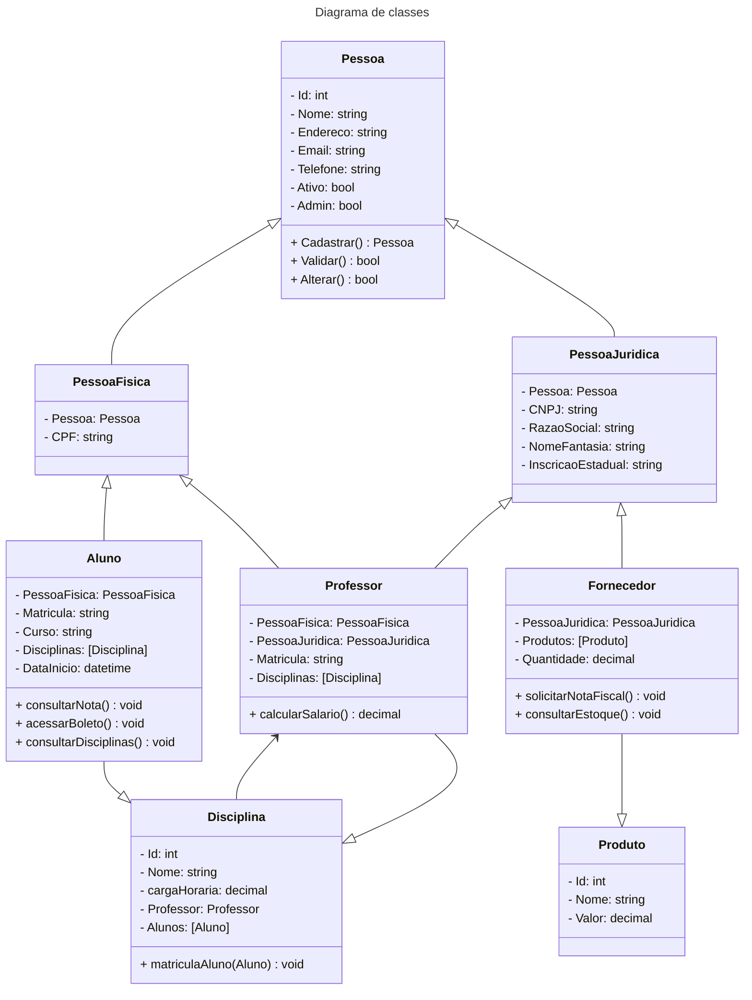
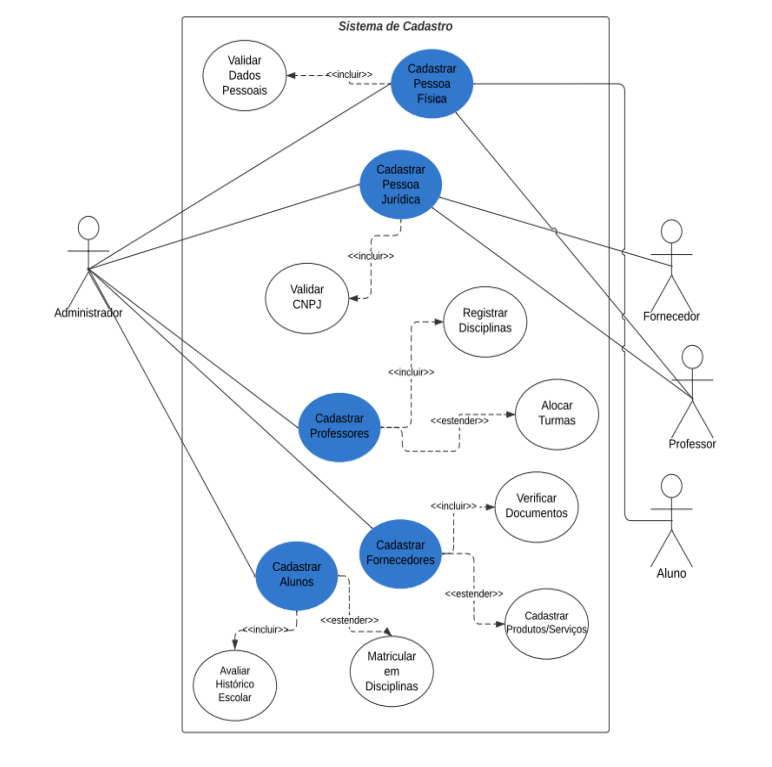

# PTI_Senac_Grupo_13

2º entrega do Projeto Integrador
Sistema de cadastro universitário 🏫

O sistema deve contemplar o cadastro de pessoas físicas e jurídicas, alunos, 
fornecedores e professores, cada um com seus próprios requisitos e necessidade de 
acesso as informações da universidade.

## Requisitos 

Aluno 🧑‍🎓
- [ ] 🔹 Cadastro de conta com informações pesoais 
- [ ] 🔹 Exclusão de conta
- [ ] 🔹 Matrícula em disciplinas
  
Professor 👩‍🔬
- [ ] 🔹 Cadastro de conta com informações pessoais
- [ ] 🔹 Caso exista adicionar informações de pessoa jurídica
- [ ] 🔹 Adicionar professor a uma disciplina
- [ ] 🔹 Consultar salário 💸

Fornecedor 👨‍💼
- [ ] 🔹 Cadastro de conta com informações da empresa 🏭
- [ ] 🔹 Cadastro de pessoa jurídica
- [ ] 🔹 Cadastro de produtos
- [ ] 🔹 Cadastro de estoque dos produtos
   

## Diagramas / UML

## Diagrama de caso de uso
