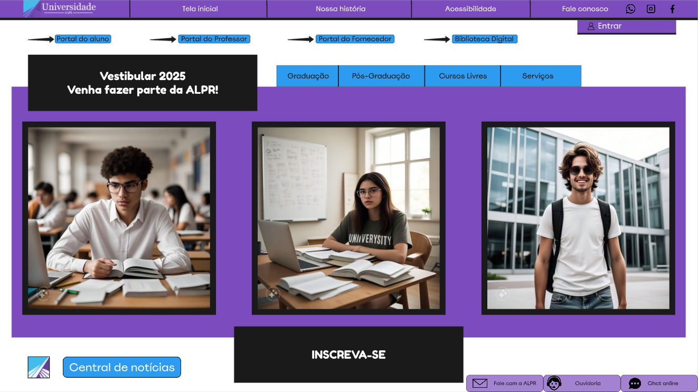
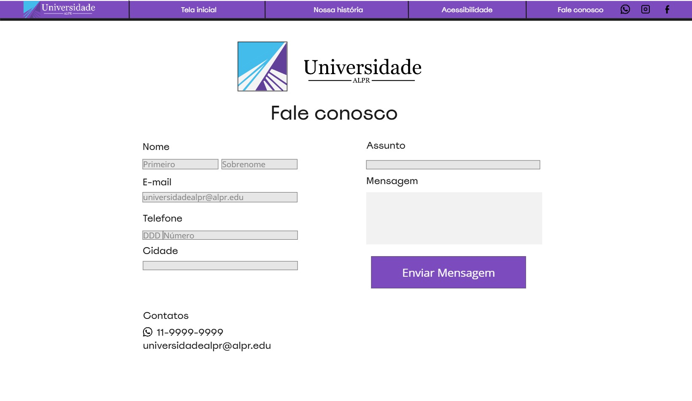
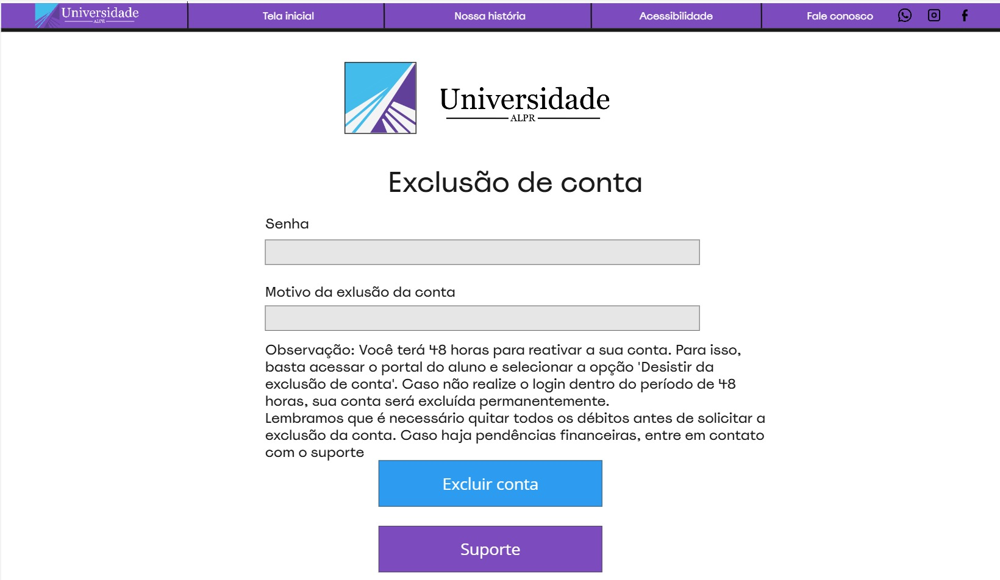
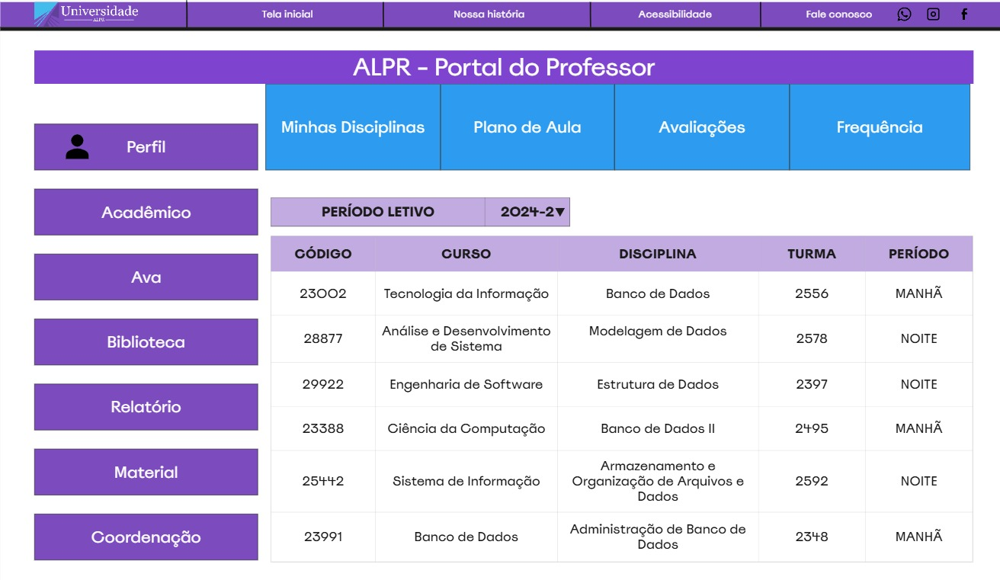
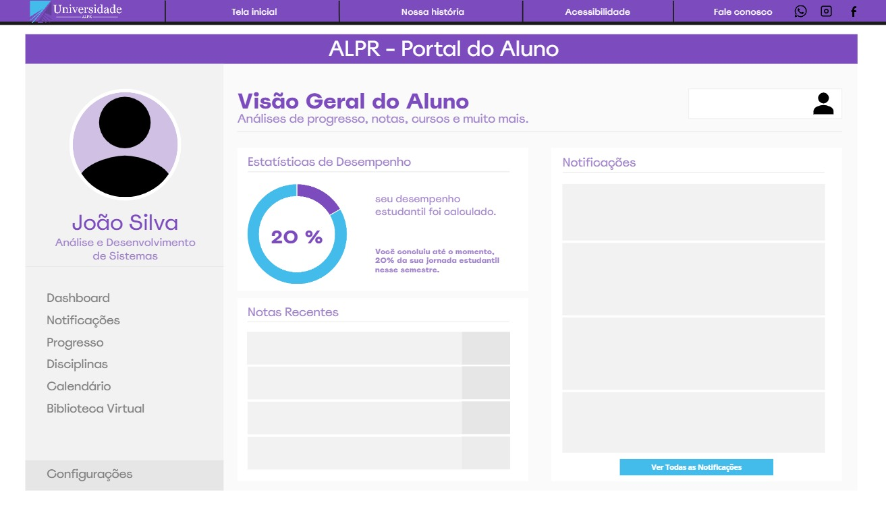
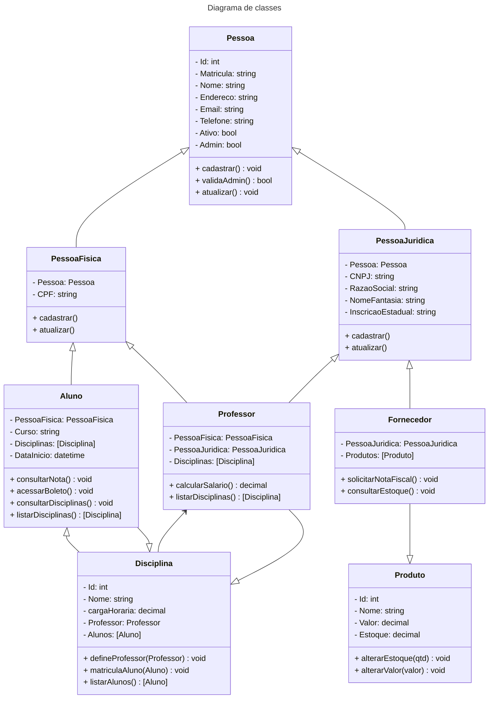

# Projeto Integrador (Grupo 13) - Senac

2º Entrega:

Desenvolvimento do sistema de cadastro universitário 🏫

O sistema deve contemplar o cadastro de pessoas físicas e jurídicas, alunos, 
fornecedores e professores, cada um com seus próprios requisitos e necessidade de 
acesso as informações da universidade.

## Requisitos 

### Geral
- [x] Página inicial
- [x] Página contato
- [x] Tela do administrador
- [x] Exclusão de conta
  
### Professor 👩‍🔬
- [x] 🔹 Portal do professor
- [x] 🔹 Lista de disciplinas/turmas
- [ ] 🔹 Lista de alunos e dar notas aos alunos

### Aluno 🧑‍🎓
- [ ] 🔹 Portal do aluno 
- [ ] 🔹 Matrícula em disciplinas
  
### Fornecedor 👨‍💼
- [ ] 🔹 Portal do fornecedor 🏭
- [ ] 🔹 Cadastro de produtos
- [ ] 🔹 Atualização de estoque e valores dos produtos

---
## Prototipação

### Geral
#### Página inicial

#### Página de contato

#### Página de exclusão de conta

---
### Portal do professor
#### Principal

---

### Portal do Aluno

---
### Portal do Fornecedor
---
## Diagramas / UML

## Diagrama de caso de uso

